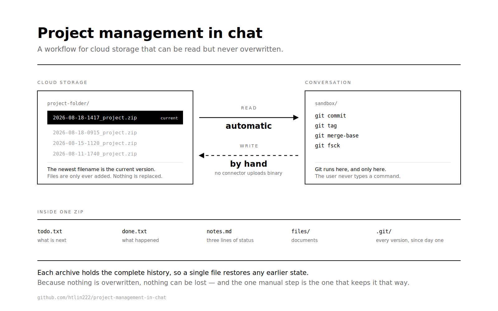

# 在對話裡做專案管理

**給「只能讀、不能寫」雲端環境的 Claude Skill。**

AI 讀得到你雲端硬碟上的檔案，卻沒辦法存回去。這個 skill 讓專案管理在這種環境下照樣成立：專案是一包含有 git 的 zip，AI 在沙盒裡幫你更新，產出新的一包，你自己上傳回雲端。

```
拖 zip 進對話  →  聊天、交代事情、問「上次到哪」  →  拿新的 zip 上傳回去
```



**不需要任何 connector。** 有唯讀 connector 的話更順 —— 直接說「去 SharePoint 的某個資料夾拿最新的」，省掉自己下載那一步。沒有也完全不影響，後面一模一樣。

git 只存在於沙盒裡。使用者不需要懂 commit、merge，也不需要安裝任何東西。

---

## 為什麼需要這個

**這不是單一廠商的限制。** 實際檢查目前的 connector 工具介面會發現：

| | 讀取 | 建立新檔 | 覆寫既有檔案 |
|---|---|---|---|
| Dropbox | ✅ | ✅ 純文字 | ❌ 沒有這個操作 |
| Google Drive | ✅ | ✅ | ❌ 只能改標題和位置 |
| OneDrive / SharePoint | ✅ | 依部署而定 | 常見為 ❌ |

Dropbox 的 `create_file` 在路徑已存在時直接回 `ALREADY_EXISTS`；Google Drive 的 `update_file` 只有 `title` 和 `parentId`，**沒有 content 欄位**。三個不同廠商，同一個形狀。

企業部署再往上疊一層資安政策，通常只留唯讀。這不是設定疏漏，而且短期內不會改變。

這帶來一個實際問題：**待辦清單需要被反覆修改，但沒有「修改」這個動作。**

多數人的反應是放棄，或是把狀態留在對話裡 —— 然後下次開新對話就全部消失。這個 skill 的做法是接受限制，把它變成設計：

| 想做的事 | 唯讀環境下的做法 |
|---|---|
| 修改檔案 | 建立一個檔名更新的版本 |
| 知道哪個是現在 | **檔名最新的那個** |
| 刪除 | 不刪。舊版永遠留著 |
| 看歷史 | zip 裡的 git |
| 存回雲端 | 使用者手動上傳 |

副作用是：**沒有任何東西會被覆蓋，所以也不可能被弄丟。** 這在合規環境下不是妥協，是優點 —— AI 改不了你的檔案，要改，你得親手放回去。

## 安裝

到 [Releases](https://github.com/htlin222/project-management-in-chat/releases) 下載 `init.skill`，在 Claude 裡上傳並儲存。

或是直接把這個 repo 當工作區打開 —— skill 已經放在 agent 會自己去找的位置：

```
init/                    唯一一份本體
.claude/skills/init  →   symlink 到 init/
.agent/skills/init   →   symlink 到 init/
HOUSEKEEPING.md      →   symlink 到 init/HOUSEKEEPING.md
```

用 symlink 而不是複製，是為了只有一份要維護。改 `init/` 裡的檔案，兩個路徑同時生效，不會出現「哪一份才是真的」這種問題。

`HOUSEKEEPING.md` 是給人看的入口：說明書在哪、兩個指令怎麼下、哪三條規則不能破。

## 怎麼用

**開一個新專案**

> 幫我開一個「病歷學會 AI 課」的專案，9/13 上課，9/11 要交件

會拿到一包 zip。放進雲端資料夾即可。

**繼續做**

> 去 SharePoint 的 /2026-09-13_病歷學會AI課 拿最新的
>
> 上次到哪？

會回報三件事，順序固定：

1. **哪個案子有風險** —— 一句話。有硬後果的（撤稿、剔除、動不了的日期）排在單純逾期之前
2. **一封信就能解鎖什麼** —— 在等別人、還有狀態不明的事
3. **什麼要到期了**

**隨手記**

> 幫我記一下要回覆成大

## 專案長什麼樣

雲端資料夾裡是一連串 release：

```
2026-09-13_病歷學會AI課/
  2026-08-18-1417_emr-ai-course.zip     ← 檔名最新 = 現在
  2026-08-18-0915_emr-ai-course.zip
  影片素材/                              ← 太大，不進 zip
```

每一包裡面：

```
todo.txt                 接下來要做什麼
done.txt                 發生過什麼（做完的、算了的）
notes.md                 三行狀態
files/                   文件
.git/                    歷史
HOUSEKEEPING.md          怎麼叫出這些 skill 來用
.claude/skills/init/     說明書本體，Claude 各介面讀這裡
.agent/skills/init/      同一份，不綁廠商的位置
```

任務一行就是一行，**沒有語法**：

```
2026-08-18 兩堂大綱與講義草稿
2026-08-18 等長庚十院回覆開講時間
2026-08-18 不確定 WCIM 註冊繳費完成沒
```

「等」和「不確定」是普通中文，不是標記。AI 回報時會自動分類（「三件在等別人，兩件不確定做了沒」），使用者不用學任何格式。

`notes.md` 只有三行，中間那行是重點：

```
現在狀態：兩堂大綱還沒動
最可能出事：講題細節沒跟主辦確認就開始備課
在等誰：長庚十院窗口
```

`todo.txt` 回答「還有什麼沒做」，「最可能出事」回答**「這個案子會不會成」** —— 那是待辦清單和專案管理的差別。

## 說明書跟著專案走

每一包 zip 裡都帶著這個 skill 自己 —— `.claude/skills/init/` 和 `.agent/skills/init/` 各一份真實檔案，加上根目錄的 `HOUSEKEEPING.md`。

理由很簡單：**zip 會在哪裡被打開，不是這裡能決定的。** 可能是另一個 Claude 介面、別家的 agent、同事那台什麼都沒裝的電腦。假設「對面裝了這個 skill」和假設「對面有 connector」是同一種錯誤 —— 在這裡成立，在別處不一定。

所以規則有三條：

- **是真實檔案，不是 symlink。** repo 裡那兩個路徑確實是 symlink，那對 git 是對的，對 zip 是錯的：Python 的 `extractall` 不會還原 symlink，它會寫出一個內容是路徑字串的純文字檔，解開之後說明書就變成一行指向不存在位置的字。多六個小檔案很便宜，說明書解開是壞的不便宜。
- **只新增，不覆寫。** 帶說明書出去的意義就是它能在對面被維護。內容不一樣時只會提示、不會蓋掉；要換成本地版本，明確下 `open.py --refresh-skill`。跟 release 同一條規則，同一個理由。
- **不設執行權限、不產生 `__pycache__`。** `extractall` 不保留權限位元，可執行檔一來一回就會被 git 看成有改動，於是每次打開都多一筆「手動編輯」—— 那個訊號本來是用來說「使用者在對話外改了東西」的，被雜訊填滿就沒用了。腳本一律用 `python3 <路徑>` 執行。

`open.py` 缺什麼補什麼，`release.py` 打包前補、打包後再把 zip 打開驗一次 —— 跟驗 `.git` 一樣，少了就不交件。兩邊都自動，不需要記得。

## 幾個踩過的坑

這些是實際撞出來的，不是設計時想到的。

### zip 的中文檔名會無聲消失

Info-ZIP 的 `zip` 指令把非 ASCII 檔名寫成 UTF-8 bytes，卻**不設 ZIP 規範的 bit 11**（宣告「這是 UTF-8」的旗標）。照規範，旗標沒設就必須當成 CP437 解讀，所以嚴格的讀取器看到亂碼，而清理亂碼的讀取器直接把字元丟掉：

```
打包時：demo-專案/筆記.md
拿到的：demo-/.md
```

壓縮檔打得開、不會報錯，只是路徑靜靜地錯了 —— `.git` 底下的路徑也一起錯。`zip -UN=UTF8` 修不了。

**而且用 `unzip` 測試會通過**，因為它會自己猜編碼、永遠顯示正確。寬容的工具會藏起這一類 bug。

本專案的做法：用 Python 的 `zipfile` 打包（會正確設旗標），驗證時用嚴格讀取器，而且**結構檔名一律 ASCII** —— 讓這個問題不存在，而不是「有正確處理」。檔案內容照樣全中文。

### 「誰比較新」在真正的衝突裡沒有答案

如果一邊的歷史包含另一邊，那不叫衝突，取後面那個就好。真正的分岔是兩邊都有對方沒有的東西 —— 這時候問「誰新」等於問「要丟掉哪一邊」。

git 給的東西比較好：找到共同起點，算出**兩邊各自多做了什麼**。加行自動合併，只有同一行說兩件相反的事才需要問人，通常二十行裡只有一兩行。

### 永遠不要 rebase

`rebase` 會產生新的 SHA。兩包本來同源，其中一包 rebase 過之後就找不到共同祖先 —— **看起來還是同一個專案，但已經無法合併了**，而且不會報錯。

## 設計理據:為什麼是 zip 而不是 git bundle

「把整個倉庫打包成一個檔案、靠人搬過去」不是新問題。git 早在 2010 年就有 [`git bundle`](https://git-scm.com/docs/git-bundle)，Scott Chacon 的[介紹文](https://scottchacon.com/2010/03/10/bundles/)稱之為 **sneakernet** —— 穿上球鞋走過去。當時針對的是斷網、隔離網段、無法存取共用伺服器。

唯讀的 AI connector 是同一個約束的當代版本:**讀得到，但沒有回程。**

我們在設計時檢視過 bundle，並實測比較(本專案骨架，1 個 commit、2 個 tag):

| | 大小 | tag | 工作區 | 內建驗證 | 使用者可直接開啟 | 未追蹤檔案 |
|---|---|---|---|---|---|---|
| `git bundle` | **1.1 KB** | ✅ | ✅ clone 後還原 | ✅ `git bundle verify` | ❌ 不透明 | ❌ **不帶** |
| zip | 18.4 KB | ✅ | ✅ | 自行驗證 | ✅ | ✅ |

bundle 小十六倍，而且**沒有壓縮檔名這個概念** —— 前述的 UTF-8 旗標問題在 bundle 中不存在，因為檔名存放於 git 物件內，本就是 UTF-8。就技術指標而言，bundle 全面勝出。

本專案仍然選擇 zip，基於兩項與**使用者族群**直接相關的理由:

**一、可直接開啟。** bundle 是不透明的二進位容器，必須有 git 才能檢視內容。zip 雙擊即開。對非工程背景的使用者，「我看得到裡面有什麼」不是便利，是信任的前提 —— 一個他無法檢查的黑盒子，他不會放心把工作交進去。

**二、未追蹤檔案不會無聲消失。** bundle 只攜帶已提交的物件，任何被 `.gitignore` 排除或未提交的檔案都不會跟著走，而且**不會有任何提示**。zip 攜帶目錄內的一切。對一個「東西不會不見」是核心承諾的系統，這個差異是決定性的。

在本專案的規模下，18 KB 與 1 KB 沒有實務差別，因此以體積換取透明度與完整性是划算的。**若使用者確定具備 git 能力、或專案體積顯著較大，bundle 是更好的選擇。**

## 舊的 zip 可以刪嗎

可以，但要先驗證。

每一包都含完整歷史，所以舊的那些**不是不同的備份，是同一份歷史的重複拷貝** —— 刪掉是整理，不是資料遺失。驗證方式是機械的:打開最新那包，看 tag 清單。要刪的那次 release 的 tag 在裡面，就代表內容完整包含。

三件事會讓這個假設不成立，而第一件是無聲的:

- **有人重跑過 `git init`** —— 新舊兩包就沒有共同歷史，舊的內容真的救不回來。tag 不見了就是徵兆
- **最新那包本身壞了** —— 下載截斷或上傳失敗時，舊的是唯一的救援
- **沒進 git 的東西不算** —— 被 `.gitignore` 排除的、或從沒放進壓縮檔的重素材

所以:**留最後兩三包，由使用者自己刪。** 這是整套系統裡唯一的破壞性操作，而系統的前提就是東西不會被破壞。

## 常見問題

**可以多人共用嗎？**

資料夾可以共享，但**上傳的人只能有一個**。兩個人各自上傳會產生兩包都聲稱是最新的，而共用時大家都以為別人處理了。合併機制存在、會自動運作，但那是善後不是設計。

**需要懂 git 嗎？**

不需要。git 只存在於沙盒裡，使用者看到的只有 zip。

**為什麼不用純文字檔就好？**

可以，而且如果你的東西夠簡單，那樣更好 —— 手機上打得開、十年後還在。zip + git 換來的是完整歷史和衝突合併，代價是內容在專案進行中不能直接瀏覽。專案結案後應該解開成純檔案封存。

**上傳那一步能自動嗎？**

在唯讀 connector 下不行，這正是這個 skill 存在的前提。它會在下次打開時檢查有沒有漏傳 —— 如果資料夾裡最新的檔案比上次交出去的還舊，會直接講出來。

## 內容

```
init/
  SKILL.md               主要指示
  references/merging.md  兩個版本的和解流程（很少用到才讀）
  scripts/open.py        下載、驗證、解開、補提交
  scripts/release.py     提交、打 tag、打包、驗證
```

兩個腳本的存在理由相同：**把容易跳過、而且失敗無聲的檢查綁在一起**，讓它們不可能被忘記。

## 相關工作與定位

### 檢索方法

檢索時間 2026 年 8 月。檢索面向包含:唯讀 connector 環境下的專案管理工作流、LLM 跨對話狀態持久化、git 離線傳輸與 sneakernet、Claude Skill 的專案管理應用，並以中英雙語各自檢索。

### 相鄰領域及其隱含前提

四個領域各自成熟，但都預設了一個在此不成立的條件 —— **儲存層可寫入**:

| 領域 | 成熟方案 | 隱含前提 |
|---|---|---|
| 離線倉庫傳輸 | `git bundle`、sneakernet | 兩端都有 git，**且使用者會用 git** |
| LLM 狀態持久化 | 資料庫、專用 workspace 服務 | 有可寫入的持久化層 |
| MCP 型專案管理 | Jira / Confluence 整合 | 具備 API 寫入權限 |
| Claude Skill 的 zip 應用 | 技能的封裝與散佈格式 | zip 承載的是**技能本身**，不是專案狀態 |

### 未被涵蓋的交集

當以下三個條件同時成立時，沒有既有方案適用:

1. 儲存層**已連接但唯讀** —— 多為企業資安政策的結果，不是設定疏漏
2. 使用者**不具工程背景** —— 不會、也不應被要求學習 git
3. 工作**跨越多次對話** —— 狀態必須存在於對話之外

這正是企業把雲端硬碟接給 AI、卻只開唯讀權限時，全體員工所處的位置。

### 本專案的定位

本專案**繼承 sneakernet 的核心洞見** —— 當沒有回程時，把完整歷史封裝進單一可攜檔案 —— 但將其**重新設計給不使用命令列的使用者**。

git 不消失，而是移至沙盒內部:使用者看到的只有一包 zip，不需要理解 commit、merge 或 tag。歷史、衝突和解、完整性驗證全部自動發生。

一句話的差別:

> `git bundle` 讓**工程師**在沒有網路時搬運倉庫。
> 這個 skill 讓**任何人**在沒有寫入權限時搬運專案。

同樣的約束，同樣的形狀，不同的使用者。

## 授權

MIT
